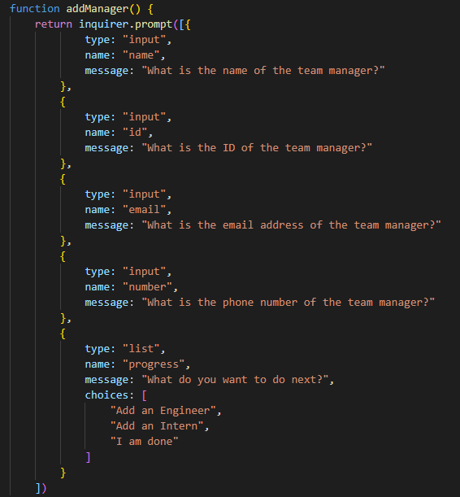
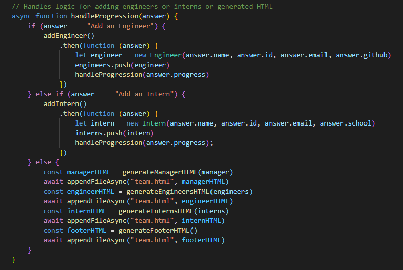
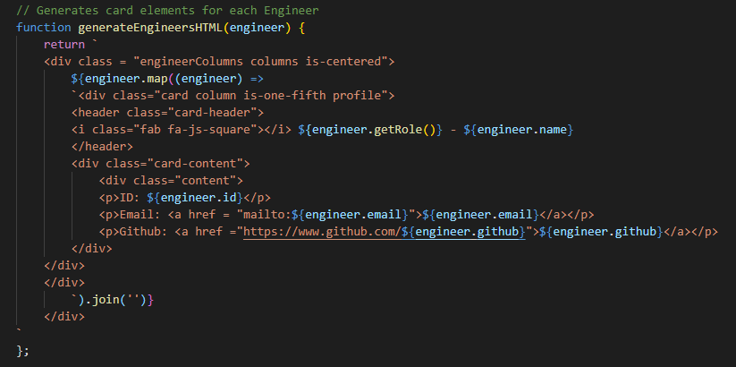

# Team Profile Generator ( CLI )

[Description](#description) 

[Installation Instructions](#installation-instructions) 

[Site Overview](#site-overview) 

[License](#license)  

[Contribution Guidelines](#contribution-guidelines) 

[Tests](#tests) 
 
[Questions](#questions)

## Description

This app is designed for someone looking to quickly and easily generate an HTML page to display their team consisting of a manger, engineers and interns and their personal information.  This is a command line interface application that runs using Node.js.  This application utilizes the external node modules Inquirer and Jest for prompting the user for answers and testing the application respectively.  It also utilizes the native modules fs and util for writing to the HTML page asyncronously.

## Ideal User

This application is aimed at a user who has a team consisting
of a manager, engineers and interns and wants to display their 
information on an HTML page with minimal effort by just answering
a few simple questions and hitting run.

## Installation Instructions

Simply clone this project to your local computer and you should be good to go! All you would need to have in advance is node.js installed so that you can utilize the modules but after that you should be able to create your very own HTML page for your team of hard working engineers interns and manager. The node modules should already be included for this project, but if they are not or they are out of date, just run a 'npm install'.   
 

## Site Overview

[Video Link to Application Tests](https://drive.google.com/file/d/1LZOV-ecCj8-AxNepbPV8jxMx03kBZikh/view)

To introduce the application, the above video will run through the different modules
that were created to create classes for Employee, Manager, Engineer and Intern.  The
modules are tested using the node module Jest.  

The Employee module is the most basic class, and is used to create the other classes
by extending Employee and adding the unique traits that the user would want to display
on the HTML file.

Please watch the video if you are interested in running the tests for yourself, or want
to get a glimpse at how the classes were constructed using Javascript.  

[Video Link to Application Overview and Instructions](https://drive.google.com/file/d/10d2epmXuZL5mgB5C5vZlAx-CM2zICzXL/view)

This video will give an overview of the app's code written in Javascript and overview how
to properly run the application in Node.js.  Once the programm is called in the terminal using
the 'node index.js' command, it will begin prompting the user for a series of questions starting
with the manager's information.

It will then ask whether the user wants to add an engineer or an intern, which they may do as many
times as they wish.  The loop will end when the user selected that they are done.  After that, the 
program will execute the function to generate an HTML page by appending various elements to a team.html
page.  

The engineer and intern loops use the javascript .map() feature of javascript to loop through however
many engineers or interns were entered into the inquirer prompt and will generate cards using the bulma
css framework into their respective divs that take up 1/5th of the container.  

The user can then use this generated team.html page to display their team proudly!  If you want to see
what the final product looks like, you can follow this link to the HTML page that was generated in the 
video demonstration and test for yourself that the links to the email and github pages are functional.  

[HTML PAGE](https://aseppala98.github.io/Team_Profile_Generator/team.html)

## License

This application uses the MIT license

## Contribution Guidelines

If you would like to contribute to this project feel free to send requests.  I only wish that you be respectful to other contributes and to the code itself and maintain good clean coding practices.  

## Tests

[Video Link to Application Tests](https://drive.google.com/file/d/1LZOV-ecCj8-AxNepbPV8jxMx03kBZikh/view)

Here is another link to the application tests also included in the site overview.  Just a reminder that you will need to have the Jest module installed for the tests to run properly.  They should be included, but if not just run an 'npm install' and that should resolve the issue.  

## Questions

If you have any questions about the application, be sure to contact me at my [e-mail](mailto:SeppalaErin98@gmail.com)

Alternatively you can find me and my other works at my [Github account](https://github.com/aseppala98)